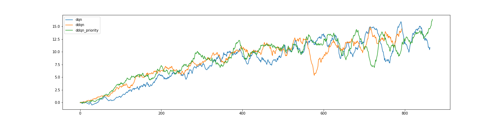

# DQN
In this project we train a DQN model to gather yellow bananas. 

The structure of the code is as follows:
- `model.py` contains the models for both the pixel banana environment and non-pixel environment. For the pixel environment we used a Duelling Convolutional Network, as well as a normal Convolutional network.
- `agents.py` implements the learning algorithm for both DQN and double DQN and has the option of adding prioritiesed replay.
- `Navigation_Pixels.py` contains the code that was *unsuccesfully* used to train a DQN model for the pixel environment.
- `Navigation.ipynb` is the notebook used to run the DQN model for the non-pixel environment.

## Model
A four layer model with 15 hidden nodes in each layer with relu activation was used.

## Double DQN
The following code within the agent implements double DQN. The only thing that changes is the target value compared to the normal DQN algorithm.
```
if self.ddqn:
    old_val = self.qnetwork_local(states).gather(-1, actions)
    with torch.no_grad():
        actions = self.qnetwork_local(next_states).argmax(-1, keepdim=True)
        maxQ = self.qnetwork_target(next_states).gather(-1, actions)
        target = rewards+gamma*maxQ*(1-dones)
else: # Normal DQN
    with torch.no_grad():
        maxQ = self.qnetwork_target(next_states).max(-1, keepdim=True)[0]
        target = rewards+gamma*maxQ*(1-dones)
    old_val = self.qnetwork_local(states).gather(-1, actions)   

self.optimizer.zero_grad()
loss = self.qnetwork_local.criterion(old_val, target)
```

## Priority Replay
We also added prioritised experience replay to see how it compares against the original algorithm.
```
if self.priority:
    p = np.array(self.error_buffer)
    p = p/p.sum()
    idx = np.random.choice(len(p), self.batch_size, replace=False, p=p)
else:
    idx = np.random.choice(len(self.memory), self.batch_size, replace=False)
```
The above code shows how an error buffer was used to choose a certain episode over the other. It gives a higher probability to instances that had higher absolute error.

## Results
Unfortunately for this problem double dqn + prioritised replay did not offer a major advantage over the normal DQN algorithm. Double DQN finished the fastest at 694 episodes compared to 764 episodes for normal DQN. The double DQN + prioritised replay finished at 770 episodes.
